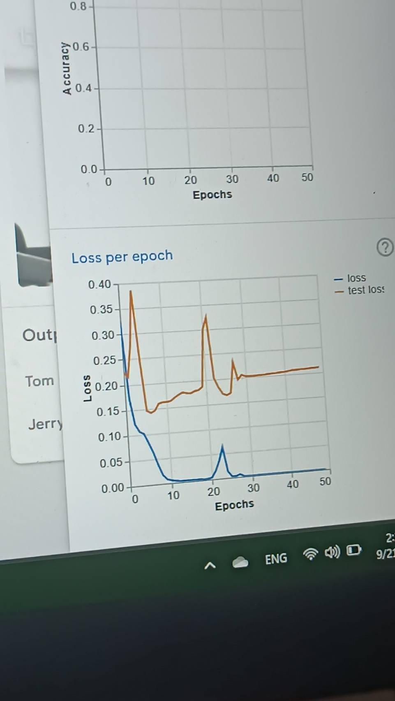
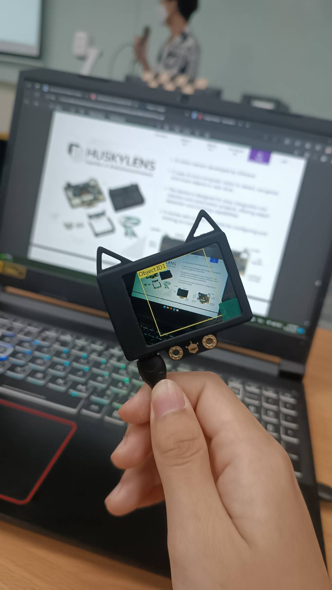
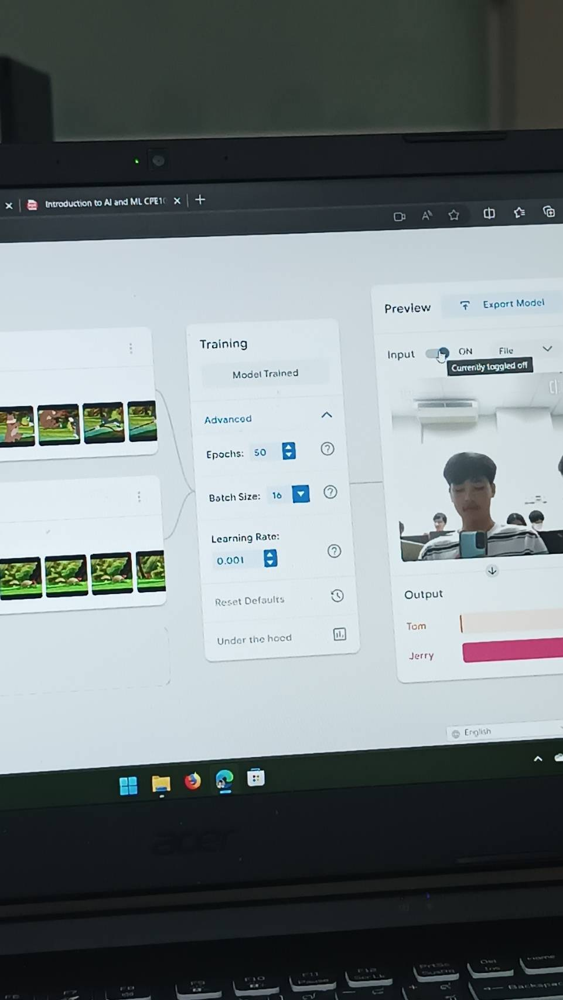

# Week 5 - AI & ML

- ในภาคทฤษฎีได้เรียน พื้นฐานของ **ปัญญาประดิษฐ์** ตั้งแต่ ประวัติ หลักการทำงาน แนวคิดเบื้องหลัง ไปจนถึง การนำไปประยุกต์ใช้ และเทคโนโลยี AI ในปัจจุบัน
- ในส่วนภาคปฏิบัติเราได้ศึกษาและทดลอง Train machine learning model บน Teachable Machine โดยจะเป็นการเทรนโมเดลประเภท Image classification และยังได้ทดลองใช้โมดูลกล้อง AI สุดแสนฉลาดสำหรับ Micro controller นั่นคือ Huskylens ซึ่งมีฟังก์ชั่นให้ทดลองมากมาย

