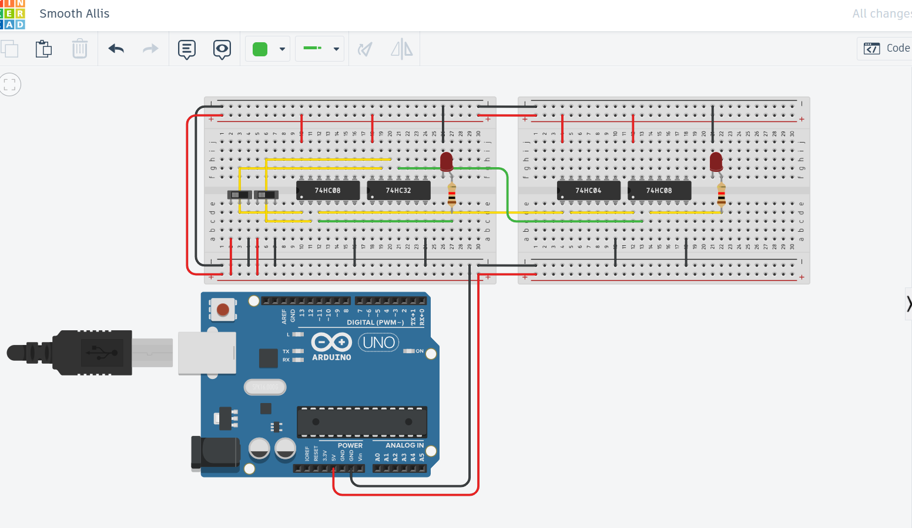
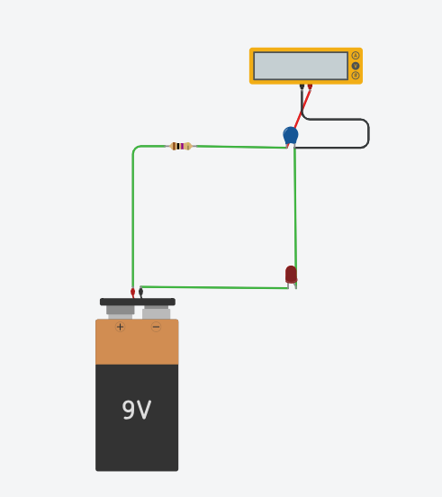

# Week 6 - TinkerCAD Circuits

- เรียนรู้เกี่ยวกับพื้นฐานของ Circuit และ Microcontroller
- การต่อวงจร logic gate เบื้องต้น โดยได้จัดทำผ่าน TinkerCad
- ศึกษาเรื่องพื้นฐานของวงจรไฟฟ้าด้วยการเรียนรู้เกี่ยวกับกฎ OHM
- ศึกษาอย่างละเอียดเกี่ยวกับตัวต้านทานรวมถึงประเภทต่างๆของตัวต้านทาน
- รู้เกี่ยวกับ Capacitors และหน้าที่ของตัวสะสมความจุในการเก็บพลังงานไฟฟ้า และการนำไปใช้ในการควบคุมเวลาและเก็บพลังงาน
- และการประยุกต์ Breadboards กับ Microcontrollers

